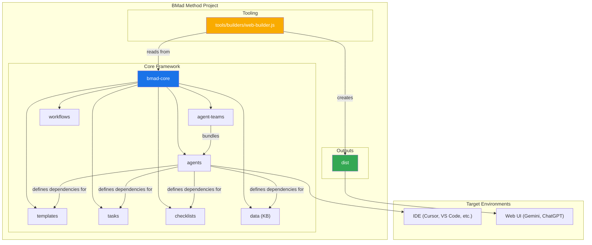
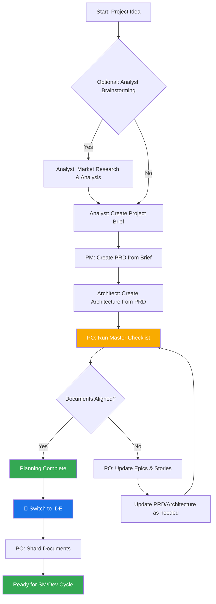
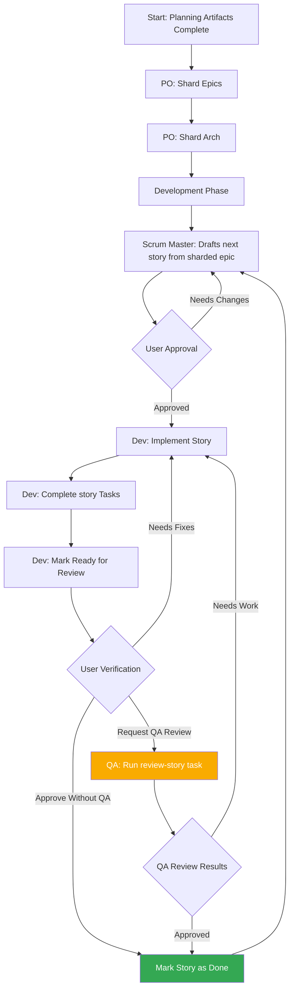

# BMad Method: コアアーキテクチャ

## 1. 概要

BMad Methodは、アジャイルエージェント開発、または大きく異なるドメインへの拡張のための繰り返し可能な有益なワークフローを可能にするエージェントモード、タスク、テンプレートを提供するよう設計されています。このプロジェクトの中核目的は、ユーザーがAIエージェント（Gemini、Claude、ChatGPTなど）をガイドして、複雑なタスク、ガイド付き議論、または他の意味のあるドメイン固有のフローを予測可能で高品質な方法で実行させるための構造化されているが柔軟なプロンプト、テンプレート、ワークフローのセットを提供することです。

システムのコアモジュールは、現代のAIエージェントツーリングの課題に対応した完全な開発ライフサイクルを促進します：

1. **発想&計画**: ブレインストーミング、市場調査、プロジェクト概要作成。
2. **アーキテクチャ&設計**: システムアーキテクチャとUI/UX仕様の定義。
3. **開発実行**: Scrum Master（SM）エージェントが非常に具体的なコンテキストでストーリーを作成し、Developer（Dev）エージェントがそれらを一つずつ実装するサイクリックなワークフロー。このプロセスは新しい（Greenfield）プロジェクトと既存（Brownfield）プロジェクトの両方で機能します。

## 2. システムアーキテクチャ図

BMad-Methodエコシステム全体は、操作の頭脳として機能するインストールされた`bmad-core`ディレクトリを中心に設計されています。`tools`ディレクトリは、この頭脳を異なる環境用に処理およびパッケージする手段を提供します。

## 3. コアコンポーネント

`bmad-core`ディレクトリには、エージェントに機能を与えるすべての定義とリソースが含まれています。

### 3.1. エージェント (`bmad-core/agents/`)

- **目的**: これらはシステムの基礎的なビルディングブロックです。各markdownファイル（例：`bmad-master.md`、`pm.md`、`dev.md`）は、単一のAIエージェントのペルソナ、機能、依存関係を定義します。
- **構造**: エージェントファイルには、その役割、ペルソナ、依存関係、起動手順を指定するYAMLヘッダーが含まれています。これらの依存関係は、エージェントが使用を許可されたタスク、テンプレート、チェックリスト、データファイルのリストです。
- **起動手順**: エージェントは、コーディング規約、API仕様、プロジェクト構造ドキュメントなどのプロジェクト固有のドキュメントを`docs/`フォルダからロードする起動シーケンスを含むことができます。これにより、有効化時に即座にプロジェクトコンテキストが提供されます。
- **ドキュメント統合**: エージェントは、タスク、ワークフロー、または起動シーケンスの一部としてプロジェクトの`docs/`フォルダからドキュメントを参照およびロードすることができます。ユーザーは、追加のコンテキストを提供するためにドキュメントをチャットインターフェースに直接ドラッグすることもできます。
- **例**: `bmad-master`エージェントはその依存関係をリストし、これにWebバンドルに含めるファイルをビルドツールに指示し、エージェントにその機能を通知します。

### 3.2. エージェントチーム (`bmad-core/agent-teams/`)

- **目的**: チームファイル（例：`team-all.yaml`）は、「フルスタック開発」や「バックエンドのみ」などの特定の目的のために一緒にバンドルされるエージェントとワークフローのコレクションを定義します。これにWeb UI環境用のより大きな、事前パッケージされたコンテキストを作成します。
- **構造**: チームファイルは含めるエージェントをリストします。すべてのエージェントを含めるために`"*"`などのワイルドカードを使用できます。これにより`team-all`のような包括的なバンドルの作成が可能になります。

### 3.3. ワークフロー (`bmad-core/workflows/`)

- **目的**: ワークフローはYAMLファイル（例：`greenfield-fullstack.yaml`）で、特定のプロジェクトタイプに対する所定のステップシーケンスとエージェント間の対話を定義します。これらはユーザーと`bmad-orchestrator`エージェントの戦略的ガイドとして機能します。
- **構造**: ワークフローは複雑なプロジェクトとシンプルなプロジェクトの両方のシーケンスを定義し、各ステップで関与するエージェント、彼らが作成する成果物、そしてあるステップから次のステップに移行するための条件をリストします。視覚化のためにMermaid図を含むことがよくあります。

### 3.4. 再利用可能リソース (`templates`, `tasks`, `checklists`, `data`)

- **目的**: これらのフォルダは、エージェンツがその依存関係に基づいて動的にロードするモジュラーコンポーネントを格納します。
  - **`templates/`**: PRD、アーキテクチャ仕様、ユーザーストーリーなどの一般的なドキュメント用のmarkdownテンプレートを含んでいます。
  - **`tasks/`**: "shard-doc"や"create-next-story"などの特定の繰り返し可能なアクションを実行するための指示を定義します。
  - **`checklists/`**: Product Owner (`po`)やArchitectなどのエージェント用の品質保証チェックリストを提供します。
  - **`data/`**: コアナレッジベース (`bmad-kb.md`)、技術的好み (`technical-preferences.md`)、その他の重要なデータファイルを含んでいます。

#### 3.4.1. Template Processing System

A key architectural principle of BMad is that templates are self-contained and interactive - they embed both the desired document output and the LLM instructions needed to work with users. This means that in many cases, no separate task is needed for document creation, as the template itself contains all the processing logic.

The BMad framework employs a sophisticated template processing system orchestrated by three key components:

- **`template-format.md`** (`bmad-core/utils/`): Defines the foundational markup language used throughout all BMad templates. This specification establishes syntax rules for variable substitution (`{{placeholders}}`), AI-only processing directives (`[[LLM: instructions]]`), and conditional logic blocks. Templates follow this format to ensure consistent processing across the system.

- **`create-doc.md`** (`bmad-core/tasks/`): Acts as the orchestration engine that manages the entire document generation workflow. This task coordinates template selection, manages user interaction modes (incremental vs. rapid generation), enforces template-format processing rules, and handles validation. It serves as the primary interface between users and the template system.

- **`advanced-elicitation.md`** (`bmad-core/tasks/`): Provides an interactive refinement layer that can be embedded within templates through `[[LLM: instructions]]` blocks. This component offers 10 structured brainstorming actions, section-by-section review capabilities, and iterative improvement workflows to enhance content quality.

The system maintains a clean separation of concerns: template markup is processed internally by AI agents but never exposed to users, while providing sophisticated AI processing capabilities through embedded intelligence within the templates themselves.

#### 3.4.2. Technical Preferences System

BMad includes a personalization layer through the `technical-preferences.md` file in `bmad-core/data/`. This file serves as a persistent technical profile that influences agent behavior across all projects.

**Purpose and Benefits:**

- **Consistency**: Ensures all agents reference the same technical preferences
- **Efficiency**: Eliminates the need to repeatedly specify preferred technologies
- **Personalization**: Agents provide recommendations aligned with user preferences
- **Learning**: Captures lessons learned and preferences that evolve over time

**Content Structure:**
The file typically includes preferred technology stacks, design patterns, external services, coding standards, and anti-patterns to avoid. Agents automatically reference this file during planning and development to provide contextually appropriate suggestions.

**Integration Points:**

- Templates can reference technical preferences during document generation
- Agents suggest preferred technologies when appropriate for project requirements
- When preferences don't fit project needs, agents explain alternatives
- Web bundles can include preferences content for consistent behavior across platforms

**Evolution Over Time:**
Users are encouraged to continuously update this file with discoveries from projects, adding both positive preferences and technologies to avoid, creating a personalized knowledge base that improves agent recommendations over time.

## 4. ビルド&デリバリープロセス

フレームワークは2つの主要な環境用に設計されています：ローカルIDEとWebベースのAIチャットインターフェースです。`web-builder.js`スクリプトは後者をサポートするための鍵です。

### 4.1. Web Builder (`tools/builders/web-builder.js`)

- **Purpose**: This Node.js script is responsible for creating the `.txt` bundles found in `dist`.
- **Process**:
  1. **Resolves Dependencies**: For a given agent or team, the script reads its definition file.
  2. It recursively finds all dependent resources (tasks, templates, etc.) that the agent/team needs.
  3. **Bundles Content**: It reads the content of all these files and concatenates them into a single, large text file, with clear separators indicating the original file path of each section.
  4. **Outputs Bundle**: The final `.txt` file is saved in the `dist` directory, ready to be uploaded to a web UI.

### 4.2. Environment-Specific Usage

- **For IDEs**: Users interact with the agents directly via their markdown files in `bmad-core/agents/`. The IDE integration (for Cursor, Claude Code, etc.) knows how to call these agents.
- **For Web UIs**: Users upload a pre-built bundle from `dist`. This single file provides the AI with the context of the entire team and all their required tools and knowledge.

## 5. BMad Workflows

### 5.1. The Planning Workflow

Before development begins, BMad follows a structured planning workflow that establishes the foundation for successful project execution:

**Key Planning Phases:**

1. **Optional Analysis**: Analyst conducts market research and competitive analysis
2. **Project Brief**: Foundation document created by Analyst or user
3. **PRD Creation**: PM transforms brief into comprehensive product requirements
4. **Architecture Design**: Architect creates technical foundation based on PRD
5. **Validation & Alignment**: PO ensures all documents are consistent and complete
6. **Refinement**: Updates to epics, stories, and documents as needed
7. **Environment Transition**: Critical switch from web UI to IDE for development workflow
8. **Document Preparation**: PO shards large documents for development consumption

**Workflow Orchestration**: The `bmad-orchestrator` agent uses these workflow definitions to guide users through the complete process, ensuring proper transitions between planning (web UI) and development (IDE) phases.

### 5.2. The Core Development Cycle

Once the initial planning and architecture phases are complete, the project moves into a cyclical development workflow, as detailed in the `bmad-kb.md`. This ensures a steady, sequential, and quality-controlled implementation process.

This cycle continues, with the Scrum Master, Developer, and optionally QA agents working together. The QA agent provides senior developer review capabilities through the `review-story` task, offering code refactoring, quality improvements, and knowledge transfer. This ensures high code quality while maintaining development velocity.
