```mermaid
graph TD
    A["Development Phase Start"] --> B["SM: Reviews Previous Story Dev/QA Notes"]
    B --> B2["SM: Drafts Next Story from Sharded Epic + Architecture"]
    B2 --> S{"High-Risk Story? (Optional)"}
    S -->|Yes| T["QA: *risk + *design on Draft Story"]
    S -->|No| B3
    T --> U["Test Strategy & Risk Profile Created"]
    U --> B3{"PO: Validate Story Draft (Optional)"}
    B3 -->|Validation Requested| B4["PO: Validate Story Against Artifacts"]
    B3 -->|Skip Validation| C{"User Approval"}
    B4 --> C
    C -->|Approved| D["Dev: Sequential Task Execution"]
    C -->|Needs Changes| B2
    D --> E["Dev: Implement Tasks + Tests"]
    E --> V{"Mid-Dev QA Check? (Optional)"}
    V -->|Yes| W["QA: *trace or *nfr for Early Validation"]
    V -->|No| F
    W --> X["Dev: Address Coverage/NFR Gaps"]
    X --> F["Dev: Run All Validations"]
    F --> G["Dev: Mark Ready for Review + Add Notes"]
    G --> H{"User Verification"}
    H -->|Request QA Review| I["QA: Test Architect Review + Quality Gate"]
    H -->|Approve Without QA| M["IMPORTANT: Verify All Regression Tests and Linting are Passing"]
    I --> J["QA: Test Architecture Analysis + Active Refactoring"]
    J --> L{"QA Decision"}
    L -->|Needs Dev Work| D
    L -->|Approved| M
    H -->|Needs Fixes| D
    M --> N["IMPORTANT: COMMIT YOUR CHANGES BEFORE PROCEEDING!"]
    N --> Y{"Gate Update Needed?"}
    Y -->|Yes| Z["QA: *gate to Update Status"]
    Y -->|No| K
    Z --> K["Mark Story as Done"]
    K --> B

    style A fill:#f5f5f5,color:#000
    style B fill:#e8f5e9,color:#000
    style B2 fill:#e8f5e9,color:#000
    style S fill:#e3f2fd,color:#000
    style T fill:#ffd54f,color:#000
    style U fill:#ffd54f,color:#000
    style B3 fill:#e3f2fd,color:#000
    style B4 fill:#fce4ec,color:#000
    style C fill:#e3f2fd,color:#000
    style D fill:#e3f2fd,color:#000
    style E fill:#e3f2fd,color:#000
    style V fill:#e3f2fd,color:#000
    style W fill:#ffd54f,color:#000
    style X fill:#e3f2fd,color:#000
    style F fill:#e3f2fd,color:#000
    style G fill:#e3f2fd,color:#000
    style H fill:#e3f2fd,color:#000
    style I fill:#f9ab00,color:#fff
    style J fill:#ffd54f,color:#000
    style K fill:#34a853,color:#fff
    style L fill:#e3f2fd,color:#000
    style M fill:#ff5722,color:#fff
    style N fill:#d32f2f,color:#fff
    style Y fill:#e3f2fd,color:#000
    style Z fill:#ffd54f,color:#000
```

# BMad Method — ユーザーガイド

このガイドでは、アジャイルAI駆動の計画および開発におけるBMad Methodを理解し、効果的に使用する方法を説明します。

## BMad計画・実行ワークフロー

まず、標準的なGreenfield計画+実行ワークフローの全体像を示します。Brownfieldも似ていますが、まず最初にこのGreenfieldを理解することをお勧めします。たとえ簡単なプロジェクトでもBrownfieldプロジェクトに取り組む前に理解しておくとよいでしょう。BMad Methodは新しいプロジェクトフォルダのルートにインストールする必要があります。計画フェーズでは、強力なWebエージェントを使用することもでき、独自のAPIキーやクレジットを提供する場合に比べて、より高品質な結果をコストのごく一部で得られる可能性があります。計画においては、強力な思考モデルとより大きなコンテキスト、そしてエージェントとのパートナーシップが最高の結果をもたらします。

BMad MethodをBrownfieldプロジェクト（既存プロジェクト）で使用する場合は、**[Brownfieldでの作業](./working-in-the-brownfield.md)**を確認してください。

下記の図が表示されない場合は、VSCode（またはそのフォーククローンのいずれか）にMarkdown All in OneとMarkdown Preview Mermaid Supportプラグインをインストールしてください。これらのプラグインを使用すると、開いているときにタブを右クリックしてOpen Previewオプションを選択するか、IDEのドキュメントを確認してください。

### 計画ワークフロー（Web UIまたは強力なIDEエージェント）

開発を始める前に、BMadはコスト効率のために理想的にはWeb UIで実行される構造化された計画ワークフローに従います：

```mermaid
graph TD
    A["Start: Project Idea"] --> B{"Optional: Analyst Research"}
    B -->|Yes| C["Analyst: Brainstorming (Optional)"]
    B -->|No| G{"Project Brief Available?"}
    C --> C2["Analyst: Market Research (Optional)"]
    C2 --> C3["Analyst: Competitor Analysis (Optional)"]
    C3 --> D["Analyst: Create Project Brief"]
    D --> G
    G -->|Yes| E["PM: Create PRD from Brief (Fast Track)"]
    G -->|No| E2["PM: Interactive PRD Creation (More Questions)"]
    E --> F["PRD Created with FRs, NFRs, Epics & Stories"]
    E2 --> F
    F --> F2{"UX Required?"}
    F2 -->|Yes| F3["UX Expert: Create Front End Spec"]
    F2 -->|No| H["Architect: Create Architecture from PRD"]
    F3 --> F4["UX Expert: Generate UI Prompt for Lovable/V0 (Optional)"]
    F4 --> H2["Architect: Create Architecture from PRD + UX Spec"]
    H --> Q{"Early Test Strategy? (Optional)"}
    H2 --> Q
    Q -->|Yes| R["QA: Early Test Architecture Input on High-Risk Areas"]
    Q -->|No| I
    R --> I["PO: Run Master Checklist"]
    I --> J{"Documents Aligned?"}
    J -->|Yes| K["Planning Complete"]
    J -->|No| L["PO: Update Epics & Stories"]
    L --> M["Update PRD/Architecture as needed"]
    M --> I
    K --> N["📁 Switch to IDE (If in a Web Agent Platform)"]
    N --> O["PO: Shard Documents"]
    O --> P["Ready for SM/Dev Cycle"]

    style A fill:#f5f5f5,color:#000
    style B fill:#e3f2fd,color:#000
    style C fill:#e8f5e9,color:#000
    style C2 fill:#e8f5e9,color:#000
    style C3 fill:#e8f5e9,color:#000
    style D fill:#e8f5e9,color:#000
    style E fill:#fff3e0,color:#000
    style E2 fill:#fff3e0,color:#000
    style F fill:#fff3e0,color:#000
    style F2 fill:#e3f2fd,color:#000
    style F3 fill:#e1f5fe,color:#000
    style F4 fill:#e1f5fe,color:#000
    style G fill:#e3f2fd,color:#000
    style H fill:#f3e5f5,color:#000
    style H2 fill:#f3e5f5,color:#000
    style Q fill:#e3f2fd,color:#000
    style R fill:#ffd54f,color:#000
    style I fill:#f9ab00,color:#fff
    style J fill:#e3f2fd,color:#000
    style K fill:#34a853,color:#fff
    style L fill:#f9ab00,color:#fff
    style M fill:#fff3e0,color:#000
    style N fill:#1a73e8,color:#fff
    style O fill:#f9ab00,color:#fff
    style P fill:#34a853,color:#fff
```



#### Web UIからIDEへの移行

**重要な移行ポイント**: POがドキュメントの整合性を確認したら、Web UIからIDEに切り替えて開発ワークフローを開始する必要があります：

1. **プロジェクトにドキュメントをコピー**: プロジェクトのdocsフォルダ（またはインストール時に指定できるカスタムの場所）に`docs/prd.md`と`docs/architecture.md`があることを確認します
2. **IDEに切り替え**: 好みのAgentic IDEでプロジェクトを開きます
3. **ドキュメントのシャーディング**: POエージェントを使用してPRD、次にArchitectureをシャードします
4. **開発開始**: 以下のコア開発サイクルを開始します

#### 計画アーティファクト（標準パス）

```text
PRD              → docs/prd.md
アーキテクチャ      → docs/architecture.md
シャードエピック     → docs/epics/
シャードストーリー    → docs/stories/
QA評価           → docs/qa/assessments/
QAゲート          → docs/qa/gates/
```

### コア開発サイクル（IDE）

計画が完了し、ドキュメントがシャードされると、BMadは構造化された開発ワークフローに従います：



## 前提条件

BMad Methodをインストールする前に、以下があることを確認してください：

- **Node.js** ≥ 18, **npm** ≥ 9
- **Git** がインストールされ設定済み
- **（オプション）** "Markdown All in One" + "Markdown Preview Mermaid Support"拡張機能を備えたVS Code

## インストール

### オプション

Claude（Sonnet 4またはOpus）、Gemini Gem（2.5 Pro）、またはCustom GPTsでWeb上で計画を行いたい場合：

1. `dist/teams/`に移動
2. `team-fullstack.txt`をコピー
3. 新しいGemini GemまたはCustomGPTを作成
4. 次の指示でファイルをアップロード：「重要な操作指示が添付されています。指示に従ってキャラクターを崩さないでください」
5. `/help`と入力して利用可能なコマンドを確認

### IDEプロジェクト設定

```bash
# インタラクティブなインストール（推奨）
npx bmad-method install
```

### Codex (CLI & Web)

BMAD integrates with OpenAI Codex via `AGENTS.md` and committed core agent files.

- Two installation modes:
  - Codex (local only): keeps `.bmad-core/` ignored for local dev.
    - `npx bmad-method install -f -i codex -d .`
  - Codex Web Enabled: ensures `.bmad-core/` is tracked so you can commit it for Codex Web.
    - `npx bmad-method install -f -i codex-web -d .`

- What gets generated:
  - `AGENTS.md` at the project root with a BMAD section containing
    - How-to-use with Codex (CLI & Web)
    - Agent Directory (Title, ID, When To Use)
    - Detailed per‑agent sections with source path, when-to-use, activation phrasing, and YAML
    - Tasks with quick usage notes
  - If a `package.json` exists, helpful scripts are added:
    - `bmad:refresh`, `bmad:list`, `bmad:validate`

- Using Codex:
  - CLI: run `codex` in the project root and prompt naturally, e.g., “As dev, implement …”.
  - Web: commit `.bmad-core/` and `AGENTS.md`, then open the repo in Codex and prompt the same way.

- Refresh after changes:
  - Re-run the appropriate install mode (`codex` or `codex-web`) to update the BMAD block in `AGENTS.md`.

## Special Agents

There are two BMad agents — in the future they'll be consolidated into a single BMad-Master.

### BMad-Master

This agent can do any task or command that all other agents can do, aside from actual story implementation. Additionally, this agent can help explain the BMad Method when on the web by accessing the knowledge base and explaining anything to you about the process.

If you don't want to bother switching between different agents aside from the dev, this is the agent for you. Just remember that as the context grows, the performance of the agent degrades, therefore it is important to instruct the agent to compact the conversation and start a new conversation with the compacted conversation as the initial message. Do this often, preferably after each story is implemented.

### BMad-Orchestrator

This agent should NOT be used within the IDE, it is a heavyweight, special-purpose agent that utilizes a lot of context and can morph into any other agent. This exists solely to facilitate the teams within the web bundles. If you use a web bundle you will be greeted by the BMad Orchestrator.

### How Agents Work

#### Dependencies System

Each agent has a YAML section that defines its dependencies:

```yaml
dependencies:
  templates:
    - prd-template.md
    - user-story-template.md
  tasks:
    - create-doc.md
    - shard-doc.md
  data:
    - bmad-kb.md
```

**Key Points:**

- Agents only load resources they need (lean context)
- Dependencies are automatically resolved during bundling
- Resources are shared across agents to maintain consistency

#### Agent Interaction

**In IDE:**

```bash
# Some IDEs, like Cursor or Windsurf for example, utilize manual rules so interaction is done with the '@' symbol
@pm Create a PRD for a task management app
@architect Design the system architecture
@dev Implement the user authentication

# Some IDEs, like Claude Code, use slash commands instead
/pm Create user stories
/dev Fix the login bug
```

#### Interactive Modes

- **Incremental Mode**: Step-by-step with user input
- **YOLO Mode**: Rapid generation with minimal interaction

## IDE Integration

### IDE Best Practices

- **Context Management**: Keep relevant files only in context, keep files as lean and focused as necessary
- **Agent Selection**: Use appropriate agent for task
- **Iterative Development**: Work in small, focused tasks
- **File Organization**: Maintain clean project structure
- **Commit Regularly**: Save your work frequently

## The Test Architect (QA Agent)

### Overview

The QA agent in BMad is not just a "senior developer reviewer" - it's a **Test Architect** with deep expertise in test strategy, quality gates, and risk-based testing. Named Quinn, this agent provides advisory authority on quality matters while actively improving code when safe to do so.

#### Quick Start (Essential Commands)

```bash
@qa *risk {story}       # Assess risks before development
@qa *design {story}     # Create test strategy
@qa *trace {story}      # Verify test coverage during dev
@qa *nfr {story}        # Check quality attributes
@qa *review {story}     # Full assessment → writes gate
```

#### Command Aliases (Test Architect)

The documentation uses short forms for convenience. Both styles are valid:

```text
*risk    → *risk-profile
*design  → *test-design
*nfr     → *nfr-assess
*trace   → *trace-requirements (or just *trace)
*review  → *review
*gate    → *gate
```

### Core Capabilities

#### 1. Risk Profiling (`*risk`)

**When:** After story draft, before development begins (earliest intervention point)

Identifies and assesses implementation risks:

- **Categories**: Technical, Security, Performance, Data, Business, Operational
- **Scoring**: Probability × Impact analysis (1-9 scale)
- **Mitigation**: Specific strategies for each identified risk
- **Gate Impact**: Risks ≥9 trigger FAIL, ≥6 trigger CONCERNS (see `tasks/risk-profile.md` for authoritative rules)

#### 2. Test Design (`*design`)

**When:** After story draft, before development begins (guides what tests to write)

Creates comprehensive test strategies including:

- Test scenarios for each acceptance criterion
- Appropriate test level recommendations (unit vs integration vs E2E)
- Risk-based prioritization (P0/P1/P2)
- Test data requirements and mock strategies
- Execution strategies for CI/CD integration

**Example output:**

```yaml
test_summary:
  total: 24
  by_level:
    unit: 15
    integration: 7
    e2e: 2
  by_priority:
    P0: 8 # Must have - linked to critical risks
    P1: 10 # Should have - medium risks
    P2: 6 # Nice to have - low risks
```

#### 3. Requirements Tracing (`*trace`)

**When:** During development (mid-implementation checkpoint)

Maps requirements to test coverage:

- Documents which tests validate each acceptance criterion
- Uses Given-When-Then for clarity (documentation only, not BDD code)
- Identifies coverage gaps with severity ratings
- Creates traceability matrix for audit purposes

#### 4. NFR Assessment (`*nfr`)

**When:** During development or early review (validate quality attributes)

Validates non-functional requirements:

- **Core Four**: Security, Performance, Reliability, Maintainability
- **Evidence-Based**: Looks for actual implementation proof
- **Gate Integration**: NFR failures directly impact quality gates

#### 5. Comprehensive Test Architecture Review (`*review`)

**When:** After development complete, story marked "Ready for Review"

When you run `@qa *review {story}`, Quinn performs:

- **Requirements Traceability**: Maps every acceptance criterion to its validating tests
- **Test Level Analysis**: Ensures appropriate testing at unit, integration, and E2E levels
- **Coverage Assessment**: Identifies gaps and redundant test coverage
- **Active Refactoring**: Improves code quality directly when safe
- **Quality Gate Decision**: Issues PASS/CONCERNS/FAIL status based on findings

#### 6. Quality Gates (`*gate`)

**When:** After review fixes or when gate status needs updating

Manages quality gate decisions:

- **Deterministic Rules**: Clear criteria for PASS/CONCERNS/FAIL
- **Parallel Authority**: QA owns gate files in `docs/qa/gates/`
- **Advisory Nature**: Provides recommendations, not blocks
- **Waiver Support**: Documents accepted risks when needed

**Note:** Gates are advisory; teams choose their quality bar. WAIVED requires reason, approver, and expiry date. See `templates/qa-gate-tmpl.yaml` for schema and `tasks/review-story.md` (gate rules) and `tasks/risk-profile.md` for scoring.

### Working with the Test Architect

#### Integration with BMad Workflow

The Test Architect provides value throughout the entire development lifecycle. Here's when and how to leverage each capability:

| **Stage**          | **Command** | **When to Use**         | **Value**                  | **Output**                                                     |
| ------------------ | ----------- | ----------------------- | -------------------------- | -------------------------------------------------------------- |
| **Story Drafting** | `*risk`     | After SM drafts story   | Identify pitfalls early    | `docs/qa/assessments/{epic}.{story}-risk-{YYYYMMDD}.md`        |
|                    | `*design`   | After risk assessment   | Guide dev on test strategy | `docs/qa/assessments/{epic}.{story}-test-design-{YYYYMMDD}.md` |
| **Development**    | `*trace`    | Mid-implementation      | Verify test coverage       | `docs/qa/assessments/{epic}.{story}-trace-{YYYYMMDD}.md`       |
|                    | `*nfr`      | While building features | Catch quality issues early | `docs/qa/assessments/{epic}.{story}-nfr-{YYYYMMDD}.md`         |
| **Review**         | `*review`   | Story marked complete   | Full quality assessment    | QA Results in story + gate file                                |
| **Post-Review**    | `*gate`     | After fixing issues     | Update quality decision    | Updated `docs/qa/gates/{epic}.{story}-{slug}.yml`              |

#### Example Commands

```bash
# Planning Stage - Run these BEFORE development starts
@qa *risk {draft-story}     # What could go wrong?
@qa *design {draft-story}   # What tests should we write?

# Development Stage - Run these DURING coding
@qa *trace {story}          # Are we testing everything?
@qa *nfr {story}            # Are we meeting quality standards?

# Review Stage - Run when development complete
@qa *review {story}         # Comprehensive assessment + refactoring

# Post-Review - Run after addressing issues
@qa *gate {story}           # Update gate status
```

### Quality Standards Enforced

Quinn enforces these test quality principles:

- **No Flaky Tests**: Ensures reliability through proper async handling
- **No Hard Waits**: Dynamic waiting strategies only
- **Stateless & Parallel-Safe**: Tests run independently
- **Self-Cleaning**: Tests manage their own test data
- **Appropriate Test Levels**: Unit for logic, integration for interactions, E2E for journeys
- **Explicit Assertions**: Keep assertions in tests, not helpers

### Gate Status Meanings

- **PASS**: All critical requirements met, no blocking issues
- **CONCERNS**: Non-critical issues found, team should review
- **FAIL**: Critical issues that should be addressed (security risks, missing P0 tests)
- **WAIVED**: Issues acknowledged but explicitly accepted by team

### Special Situations

**High-Risk Stories:**

- Always run `*risk` and `*design` before development starts
- Consider mid-development `*trace` and `*nfr` checkpoints

**Complex Integrations:**

- Run `*trace` during development to ensure all integration points tested
- Follow up with `*nfr` to validate performance across integrations

**Performance-Critical:**

- Run `*nfr` early and often during development
- Don't wait until review to discover performance issues

**Brownfield/Legacy Code:**

- Start with `*risk` to identify regression dangers
- Use `*review` with extra focus on backward compatibility

### Best Practices

- **Early Engagement**: Run `*design` and `*risk` during story drafting
- **Risk-Based Focus**: Let risk scores drive test prioritization
- **Iterative Improvement**: Use QA feedback to improve future stories
- **Gate Transparency**: Share gate decisions with the team
- **Continuous Learning**: QA documents patterns for team knowledge sharing
- **Brownfield Care**: Pay extra attention to regression risks in existing systems

### Output Paths Reference

Quick reference for where Test Architect outputs are stored:

```text
*risk-profile  → docs/qa/assessments/{epic}.{story}-risk-{YYYYMMDD}.md
*test-design   → docs/qa/assessments/{epic}.{story}-test-design-{YYYYMMDD}.md
*trace         → docs/qa/assessments/{epic}.{story}-trace-{YYYYMMDD}.md
*nfr-assess    → docs/qa/assessments/{epic}.{story}-nfr-{YYYYMMDD}.md
*review        → QA Results section in story + gate file reference
*gate          → docs/qa/gates/{epic}.{story}-{slug}.yml
```

## Technical Preferences System

BMad includes a personalization system through the `technical-preferences.md` file located in `.bmad-core/data/` - this can help bias the PM and Architect to recommend your preferences for design patterns, technology selection, or anything else you would like to put in here.

### Using with Web Bundles

When creating custom web bundles or uploading to AI platforms, include your `technical-preferences.md` content to ensure agents have your preferences from the start of any conversation.

## Core Configuration

The `bmad-core/core-config.yaml` file is a critical config that enables BMad to work seamlessly with differing project structures, more options will be made available in the future. Currently the most important is the devLoadAlwaysFiles list section in the yaml.

### Developer Context Files

Define which files the dev agent should always load:

```yaml
devLoadAlwaysFiles:
  - docs/architecture/coding-standards.md
  - docs/architecture/tech-stack.md
  - docs/architecture/project-structure.md
```

You will want to verify from sharding your architecture that these documents exist, that they are as lean as possible, and contain exactly the information you want your dev agent to ALWAYS load into its context. These are the rules the agent will follow.

As your project grows and the code starts to build consistent patterns, coding standards should be reduced to include only the standards the agent still needs enforced. The agent will look at surrounding code in files to infer the coding standards that are relevant to the current task.

## Getting Help

- **Discord Community**: [Join Discord](https://discord.gg/gk8jAdXWmj)
- **GitHub Issues**: [Report bugs](https://github.com/bmadcode/bmad-method/issues)
- **Documentation**: [Browse docs](https://github.com/bmadcode/bmad-method/docs)
- **YouTube**: [BMadCode Channel](https://www.youtube.com/@BMadCode)

## Conclusion

Remember: BMad is designed to enhance your development process, not replace your expertise. Use it as a powerful tool to accelerate your projects while maintaining control over design decisions and implementation details.
